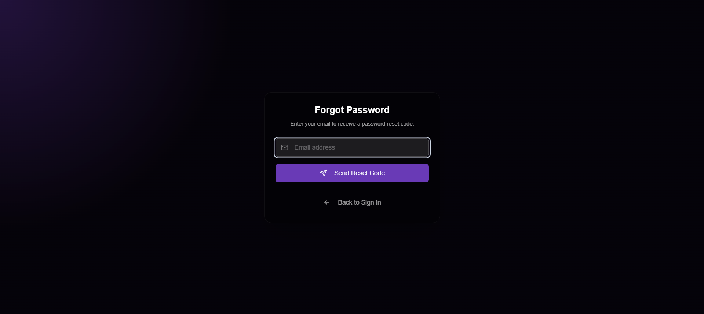
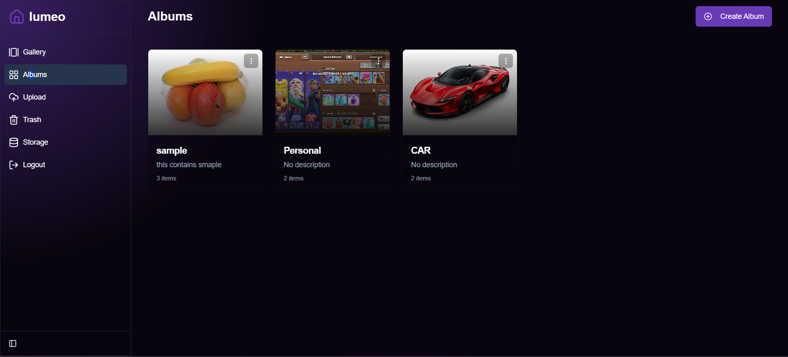

README.md
# 🎨 Lumeo - A Personal Free Cloud Media Gallery Storage


 

[](LICENSE)  
[](https://vercel.com/new)  

**Lumeo** is a **Next.js web application** that acts as a **personal media gallery**.  
It uses **Telegram** for storage and **Supabase** for metadata management, allowing you to **upload, view, and organize images, videos, and documents** in a stunning, responsive gallery.

---

## 🌟 Features

| Feature | Description |
|---------|-------------|
| 📂 **Album Organization** | Organize files into multiple albums |
| 🖼 **Multi-file Support** | Upload images, videos, and documents |
| 🚀 **Telegram Storage** | Uses Telegram’s robust file storage |
| 🗄 **Supabase Backend** | Fast metadata storage and querying |
| 🖼 **Responsive Gallery** | Masonry-style, fluid layout |
| 📝 **File Management** | Edit captions, move files across albums |
| 🗑 **Trash Bin** | Soft-delete files or permanently remove them |

---

## 📸 Demo / Preview


### Front Page

*A clean landing page welcoming users to Lumeo.*

### Sign In Form

*Users can securely log in with email/password.*

### Reset Password

*Easily reset your password with a simple form.*

### Gmail OTP Verification

*Secure login with Gmail OTP for added security.*

### gallery

*gallery view.*

### Albums

*Organize your files into albums for easy access.*

### Upload Files

*Upload your media files safely.*

### Storage

*monitor your storage.*


---

## ⚡ Tech Stack

- **Frontend:** [Next.js](https://nextjs.org/) + [React](https://react.dev/)  
- **Backend:** [Supabase](https://supabase.com/)  
- **Storage:** [Telegram Bot API](https://core.telegram.org/bots/api)  
- **Styling:** TailwindCSS  

---

## 🚀 Getting Started

### 1️⃣ Clone the Repository

```bash
git clone https://github.com/milan-m-antony/lumeo-teli-gallery.git

cd lumeo

2️⃣ Install Dependencies
npm install


Installs all required packages including Supabase CLI.

3️⃣ Setup Environment Variables

Create .env.local in the root:

# Supabase Configuration
NEXT_PUBLIC_SUPABASE_URL=
NEXT_PUBLIC_SUPABASE_ANON_KEY=
SUPABASE_SERVICE_KEY=

# Telegram Bot Configuration
TELEGRAM_BOT_TOKEN=
TELEGRAM_CHANNEL_ID=
NEXT_PUBLIC_TG_BOT_TOKEN=


Replace each value with your credentials.

🔧 Setup & Configuration

For database setup, migrations, and Edge Function deployment, see SETUP.md
.

🖥 Running Locally
npm run dev


Visit http://localhost:3000
.
Create an account and start uploading your media.

🌐 Production Deployment
npm run deploy


This deploys the password-reset Edge Function and builds an optimized production version of the app.

🤝 Contributing

Contributions are welcome!

Fork the repository

Create a branch: feature/YourFeature

Commit your changes

Open a Pull Request

---

This project is licensed under the [MIT License](./LICENSE).

© 2025 Milan M Antony
---
